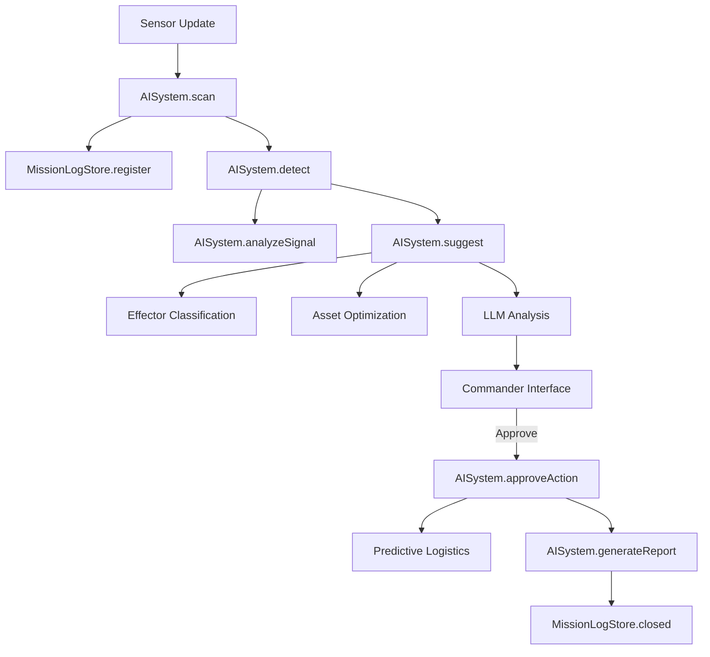

# SAAB Rookery AI System Workflow & Documentation

This document explains the structure and workflow of the AI system implemented in `ai-system.js`, which serves as the core engine for situational analysis and decision support in the SAAB C2 Tactical Dashboard.

---

## 1. System Architecture

The AI system is divided into two primary components that work in tandem:

1.  **AISystem (Logic Engine)**: Controls the tactical processing pipeline, from raw sensor data ingestion to final reporting.
2.  **MissionLogStore (Data & Event Engine)**: Manages data persistence (using `localStorage`) and listens for global events to automatically update mission timelines.

---

## 2. AI Pipeline Workflow

The system follows the **SCAN-DETECT-SUGGEST-PROTECT-REPORT** model:

### Phase 1: SCAN (Sensor Ingestion)
- **Role**: Ingest raw sensor data (Radar, ADS-B, ESM).
- **Process**: 
    - Receives Speed, Distance, and IFF (Identification Friend or Foe) status.
    - Forwards data to `MissionLogStore` to create a new mission record or update an existing one.
- **Outcome**: Data enters the system and the mission timeline is initiated.

### Phase 2: DETECT (Threat Assessment & SIGINT)
- **Role**: Evaluate threat levels and intent.
- **Process**:
    - Calculates a **Threat Score** (0-100) based on speed (>800 kts), proximity (<50 NM), and IFF status.
    - Initiates **SIGINT (Signal Intelligence)**: Analyzes radio signals (VOICE), datalink patterns (DATALINK), and pilot behavior.
- **Outcome**: Threat score determined and confidence level established.

### Phase 3: SUGGEST (Tactical Recommendations)
- **Role**: Propose optimal response options.
- **Sub-processes**:
    1.  **Effector Classification**: Selects the most appropriate "effector" or unit (Gripen for high-speed intercepts, Drone for reconnaissance, or GBAD for base defense).
    2.  **Asset Optimization**: Identifies the base with the highest readiness and closest proximity to scramble the unit.
    3.  **LLM Reasoning**: If an API Key is available (OpenRouter/Gemini), the AI generates a natural language tactical recommendation that is professional and decisive.
- **Outcome**: Clear recommendations with supporting reasoning displayed for the Commander.

### Phase 4: PROTECT (Human-In-The-Loop - HITL)
- **Role**: Wait for human authorization.
- **Process**:
    - The system enters a **Pending** state until the Commander clicks **Approve** or **Reject**.
    - If Approved: Commands are dispatched to the selected units, and the **Predictive Logistics** system is triggered immediately.
- **Outcome**: Tactical operations are executed based on human command.

### Phase 5: REPORT (Mission Closure)
- **Role**: Summarize operational results.
- **Process**:
    - Consolidates all logs generated during the mission.
    - Records the final **Outcome** (e.g., Intercepted, Resolved, or Monitoring).
- **Outcome**: A comprehensive mission report is archived in the **Mission Logs**.

---

## 3. Intelligent Features

### 🛰️ Predictive Logistics
When an aircraft is scrambled, the system immediately calculates the remaining resources at the base. If readiness drops below 60%, the system triggers a **"Predictive Repositioning"** alert, suggesting the transfer of assets from other available bases to ensure continued capability.

### 📡 SIGINT & Signal Analysis
The AI simulates the interception and translation of target transmissions (e.g., "Target pilot stress detected" or "Datalink coordination confirmed") to help the Commander understand the target's intent more clearly.

### 📝 Mission Log Persistence
All mission data is stored in the browser's `localStorage`. This ensures that mission records, timelines, and audit trails persist across page refreshes or browser restarts, accessible via the **Mission Logs** page.

---

## 4. Event & Data Flow (Mermaid)

---
*This documentation was prepared for the SAAB Smart Stridsledning Hackathon.*
