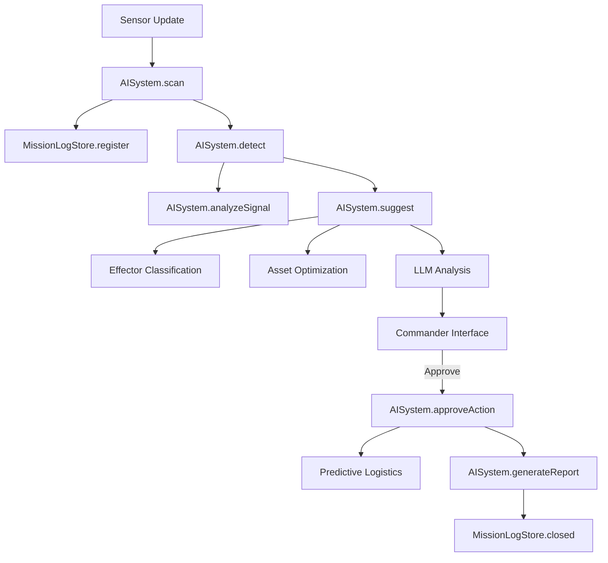

# Workflow และการทำงานของ SAAB Rookery AI System

เอกสารนี้อธิบายโครงสร้างและขั้นตอนการทำงานของระบบ AI ในไฟล์ `ai-system.js` ซึ่งเป็นหัวใจหลักในการวิเคราะห์สถานการณ์และสนับสนุนการตัดสินใจใน Dashboard C2 นี้

---

## 1. ภาพรวมสถาปัตยกรรม (System Architecture)

ระบบ AI แบ่งออกเป็น 2 ส่วนหลักที่ทำงานร่วมกัน:

1.  **AISystem (Logic Engine)**: ควบคุม Pipeline การประมวลผลทางยุทธวิธี ตั้งแต่การรับข้อมูลเซนเซอร์ไปจนถึงการออกรายงาน
2.  **MissionLogStore (Data & Event Engine)**: ทำหน้าที่บันทึกข้อมูล (Persistence) ลงใน `localStorage` และคอยดักฟัง Event ต่างๆ เพื่ออัปเดต Timeline ของภารกิจโดยอัตโนมัติ

---

## 2. ขั้นตอนการทำงาน (AI Pipeline Workflow)

ระบบทำงานตามโมเดล **SCAN-DETECT-SUGGEST-PROTECT-REPORT** ดังนี้:

### ขั้นที่ 1: SCAN (Sensor Ingestion)
- **หน้าที่**: รับข้อมูลดิบจากเซนเซอร์ (Radar, ADS-B, ESM)
- **กระบวนการ**: 
    - รับค่า Speed, Distance, และ IFF (Identification Friend or Foe)
    - ส่งข้อมูลไปที่ `MissionLogStore` เพื่อสร้าง Mission Record ใหม่ หรืออัปเดต Record เดิมที่มีอยู่
- **ผลลัพธ์**: ข้อมูลเข้าสู่ระบบและเริ่มเปิด Timeline ของภารกิจ

### ขั้นที่ 2: DETECT (Threat Assessment & SIGINT)
- **หน้าที่**: ประเมินระดับภัยคุกคาม
- **กระบวนการ**:
    - คำนวณ **Threat Score** (0-100) โดยอิงจากความเร็ว (เกิน 800 kts), ระยะห่าง (น้อยกว่า 50 NM), และสถานะ IFF
    - รันระบบ **SIGINT (Signal Intelligence)**: วิเคราะห์สัญญาณวิทยุ (VOICE), รูปแบบการส่งข้อมูล (DATALINK), และพฤติกรรมของนักบิน
- **ผลลัพธ์**: ระบุระดับความมั่นใจ (Confidence) และคะแนนภัยคุกคาม

### ขั้นที่ 3: SUGGEST (Tactical Recommendations)
- **หน้าที่**: เสนอทางเลือกในการรับมือ
- **กระบวนการแยกย่อย**:
    1.  **Effector Classification**: เลือก "อาวุธ" หรือ "หน่วย" ที่เหมาะสมที่สุด (Gripen สำหรับเป้าหมายความเร็วสูง, Drone สำหรับเป้าหมายสอดแนม, หรือ GBAD สำหรับการป้องกันเขตฐานทัพ)
    2.  **Asset Optimization**: ค้นหาฐานทัพที่มีความพร้อม (Readiness) สูงสุดและอยู่ใกล้ที่สุดเพื่อส่งหน่วยออกไป
    3.  **LLM Reasoning**: หากมีการเชื่อมต่อ API Key (OpenRouter/Gemini) AI จะสร้างคำแนะนำแบบภาษาธรรมชาติ (Natural Language) ที่ดูเป็นมืออาชีพและชัดเจน
- **ผลลัพธ์**: คำแนะนำที่ชัดเจนพร้อมเหตุผลสนับสนุน (Reasoning) ปรากฏบนหน้าจอให้ผู้บัญชาการเลือก

### ขั้นที่ 4: PROTECT (Human-In-The-Loop - HITL)
- **หน้าที่**: รอการตัดสินใจจากมนุษย์
- **กระบวนการ**:
    - ระบบจะหยุดรอ (Pending) จนกว่า Commander จะกด **Approve** หรือ **Reject**
    - หาก Approve: ส่งคำสั่งไปยังหน่วยงานที่เกี่ยวข้อง และรันระบบ **Predictive Logistics** ต่อทันที
- **ผลลัพธ์**: การปฏิบัติการทางยุทธวิธีเริ่มขึ้นจริงตามคำสั่งมนุษย์

### ขั้นที่ 5: REPORT (Mission Closure)
- **หน้าที่**: สรุปผลการปฏิบัติงาน
- **กระบวนการ**:
    - รวบรวม Logs ทั้งหมดที่เกิดขึ้นในภารกิจ
    - บันทึกผลลัพธ์สุดท้าย (Outcome) เช่น Intercepted, Resolved หรือ Monitoring
- **ผลลัพธ์**: รายงานภารกิจฉบับสมบูรณ์ถูกเก็บไว้ในประวัติ (Mission Logs)

---

## 3. ระบบเสริมอัจฉริยะ (Special Intelligence Features)

### 🛰️ Predictive Logistics (การพยากรณ์ลอจิสติกส์)
เมื่อมีการส่งเครื่องบิน (Scramble) ออกไป ระบบจะคำนวณทันทีว่าฐานทัพนั้นเหลือทรัพยากรเท่าไหร่ หากความพร้อมลดต่ำกว่า 60% ระบบจะแจ้งเตือนให้ **"โอนย้ายทรัพยากร (Transfer)"** จากฐานทัพอื่นที่ยังว่างอยู่มาทดแทนโดยอัตโนมัติ

### 📡 SIGINT & Signal Analysis
AI สามารถจำลองการดักฟังและแปลข้อความจากเป้าหมายได้ (เช่น "Target pilot stress detected" หรือ "Datalink coordination confirmed") เพื่อช่วยให้ Commander เห็นเจตนา (Intent) ของเป้าหมายได้ชัดเจนขึ้น

### 📝 Mission Log Persistence
ข้อมูลทุกอย่างถูกเก็บไว้ใน `localStorage` ของ Browser ทำให้แม้จะ Refresh หน้าจอ หรือปิดเครื่องไป ข้อมูลภารกิจที่เคยทำไว้ก็จะไม่หายไป และสามารถกลับมาดูย้อนหลังได้ที่หน้า **Mission Logs**

---

## 4. แผนผังการส่งข้อมูล (Event Flow)

---
*เอกสารนี้จัดทำขึ้นเพื่อใช้ประกอบการทำความเข้าใจระบบ AI ในโครงการ SAAB Smart Stridsledning Hackathon*
